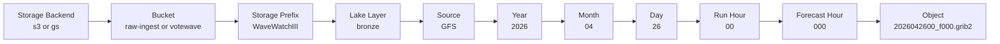
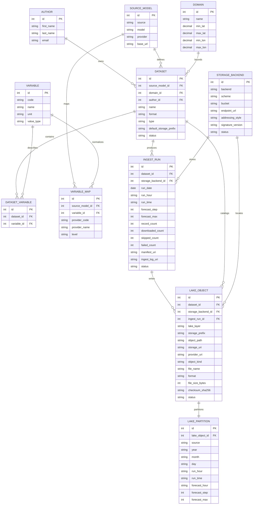

# Data Lake Schema

This schema describes the metadata model for ingesting GFS / WaveWatch output into object storage. The current ingest branch writes objects to a data lake path such as:

```text
s3://raw-ingest/WaveWatchIII/bronze/GFS/2026/04/26/00/000/2026042600_f000.grib2
```

General path template:

```text
{scheme}://{bucket}/{storage_prefix}/{lake_layer}/{source}/{yyyy}/{mm}/{dd}/{run_hour}/{forecast_hour}/{file_name}
```

Where:

- `scheme` is `gs` for GCS or `s3` for S3 / Ceph.
- `storage_prefix` is the top-level product or dataset prefix, for example `WaveWatchIII`.
- `lake_layer` is the lake zone, for example `bronze` for raw ingest output.
- `source` is the upstream model/source, for example `GFS`.
- Date partitions are split into `yyyy`, `mm`, `dd`, `run_hour`, and `forecast_hour`.

---

## Data lake path visualization



Example expanded path:

```text
s3://raw-ingest
  /WaveWatchIII
    /bronze
      /GFS
        /2026
          /04
            /26
              /00
                /000
                  /2026042600_f000.grib2
```

---

## Metadata relationship visualization



---

## Dataset

Represents a logical dataset or model product, independent of a single physical object.

- `id` — primary key
- `source_model_id` — FK -> `SourceModel.id`
- `name` — string, for example `WaveWatchIII GFS wind ingest`
- `description` — string
- `domain_id` — FK -> `Domain.id`
- `format` — enum/string: `grib2`, `grib`, `netcdf`, `json`, `tif`
- `type` — enum/string: `gridded`, `spectra`
- `default_storage_prefix` — string, for example `WaveWatchIII`
- `status` — enum/string: `active`, `deprecated`, `failed`, `archived`
- `author_id` — FK -> `Author.id`
- `created_at` — timestamp
- `updated_at` — timestamp

---

## SourceModel

Represents an upstream data source and model family.

- `id` — primary key
- `source` — string, for example `GFS`
- `model` — string, for example `WW3`
- `provider` — string, for example `NOAA/NCEP`
- `base_url` — string
- `description` — string

---

## StorageBackend

Represents a storage system where lake objects are written.

- `id` — primary key
- `backend` — enum/string: `gcs`, `s3`
- `scheme` — enum/string: `gs`, `s3`
- `bucket` — string, for example `raw-ingest`
- `endpoint_url` — string / nullable, for example `http://10.11.1.171:30080` for Ceph
- `addressing_style` — enum/string / nullable: `path`, `virtual`
- `signature_version` — string / nullable, for example `s3v4`
- `region` — string / nullable
- `status` — enum/string: `active`, `disabled`

Do not store access keys or secrets in this table. Credentials should live in the runtime secret manager or environment variables.

---

## LakeObject

Represents one physical object in the data lake, such as a GRIB2 file, ingest log, or manifest.

- `id` — primary key
- `dataset_id` — FK -> `Dataset.id`
- `storage_backend_id` — FK -> `StorageBackend.id`
- `ingest_run_id` — FK -> `IngestRun.id`
- `lake_layer` — enum/string: `bronze`, `silver`, `gold`
- `storage_prefix` — string, for example `WaveWatchIII`
- `object_path` — string, for example `WaveWatchIII/bronze/GFS/2026/04/26/00/000/2026042600_f000.grib2`
- `storage_uri` — string, for example `s3://raw-ingest/WaveWatchIII/bronze/GFS/2026/04/26/00/000/2026042600_f000.grib2`
- `provider_uri` — string / nullable, backward-compatible provider-specific URI such as `gcs_uri` or `s3_uri`
- `object_kind` — enum/string: `data_file`, `ingest_log`, `manifest`, `metadata`
- `file_name` — string
- `format` — enum/string: `grib2`, `grib`, `netcdf`, `json`, `tif`
- `file_size_bytes` — integer / nullable
- `checksum_sha256` — string / nullable
- `status` — enum/string: `downloaded_and_uploaded`, `skipped_already_exists`, `failed`
- `error` — string / nullable
- `created_at` — timestamp

---

## LakePartition

Represents the partition values encoded in a lake object path.

- `id` — primary key
- `lake_object_id` — FK -> `LakeObject.id`
- `source` — string, for example `GFS`
- `year` — string, `YYYY`
- `month` — string, `MM`
- `day` — string, `DD`
- `run_hour` — string, `HH`
- `run_time` — string, `YYYYMMDDHH`
- `forecast_hour` — string, `000`, `003`, `006`, etc.
- `forecast_step` — integer / nullable
- `forecast_max` — integer / nullable

Recommended unique constraint:

- (`source`, `run_time`, `forecast_hour`, `lake_object_id`)

---

## IngestRun

Represents one execution of the ingest process for a date/run-hour range.

- `id` — primary key
- `dataset_id` — FK -> `Dataset.id`
- `storage_backend_id` — FK -> `StorageBackend.id`
- `run_date` — date
- `run_hour` — string, `HH`
- `run_time` — string, `YYYYMMDDHH`
- `forecast_step` — integer
- `forecast_max` — integer
- `record_count` — integer
- `downloaded_count` — integer
- `skipped_count` — integer
- `failed_count` — integer
- `manifest_uri` — string / nullable
- `ingest_log_uri` — string / nullable
- `status` — enum/string: `running`, `completed`, `completed_with_failures`, `failed`
- `started_at` — timestamp / nullable
- `finished_at` — timestamp / nullable
- `generated_at` — timestamp / nullable

---

## Domain

Represents a spatial domain for a dataset.

- `id` — primary key
- `name` — string
- `min_lat` — decimal / nullable
- `max_lat` — decimal / nullable
- `min_lon` — decimal / nullable
- `max_lon` — decimal / nullable
- `elevation` — string / nullable
- `range` — array/object / nullable

---

## Variable

Represents a normalized scientific variable.

- `id` — primary key
- `code` — string
- `name` — string
- `unit` — string
- `value_type` — string

---

## DatasetVariable

Maps datasets to the variables they contain.

- `id` — primary key
- `dataset_id` — FK -> `Dataset.id`
- `variable_id` — FK -> `Variable.id`

Recommended unique constraint:

- (`dataset_id`, `variable_id`)

---

## VariableMap

Maps upstream model/provider variable codes to normalized variables.

- `id` — primary key
- `source_model_id` — FK -> `SourceModel.id`
- `variable_id` — FK -> `Variable.id`
- `provider_code` — string, for example `UGRD` or `VGRD`
- `provider_name` — string / nullable
- `level` — string / nullable, for example `10 m above ground`

---

## Author

Represents a person or system that created or owns the dataset definition.

- `id` — primary key
- `first_name` — string
- `last_name` — string
- `email` — string / nullable

---

## Example records

### StorageBackend

```json
{
  "backend": "s3",
  "scheme": "s3",
  "bucket": "raw-ingest",
  "endpoint_url": "http://10.11.1.171:30080",
  "addressing_style": "path",
  "signature_version": "s3v4",
  "status": "active"
}
```

### LakeObject

```json
{
  "lake_layer": "bronze",
  "storage_prefix": "WaveWatchIII",
  "object_path": "WaveWatchIII/bronze/GFS/2026/04/26/00/000/2026042600_f000.grib2",
  "storage_uri": "s3://raw-ingest/WaveWatchIII/bronze/GFS/2026/04/26/00/000/2026042600_f000.grib2",
  "object_kind": "data_file",
  "file_name": "2026042600_f000.grib2",
  "format": "grib2",
  "status": "downloaded_and_uploaded"
}
```
